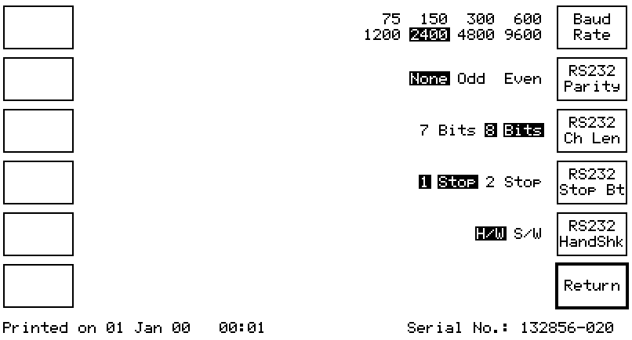

# PCLSerialPrinter

This is a very simple QT5 based application that will receive a PCL printed raster image over a serial port and display it.

It is tested and working on Windows & Linux (using a Marconi 2945 to print) but currently at speeds above 2400baud corruption is occurring which suggests something is wrong with the handshaking.

This is an example capture showing the Serial settings that are currently working on my Marconi 2945

